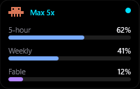
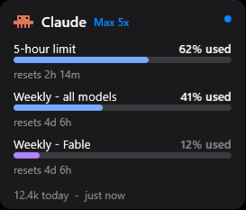
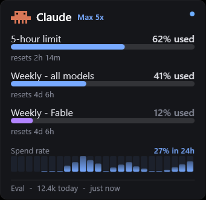

# ClaudeLune

[](https://github.com/Luneswan/claudelune/actions/workflows/tests.yml)

A Rainmeter panel that keeps your Claude Code usage limits on the desktop. The
5-hour session window, the weekly allowance, and whatever per-model limit your
plan carries, all visible without opening a browser or typing anything.

It reads the credentials Claude Code already stores on your machine. There is no
API key to paste and nothing to sign into a second time.

| Small | Normal | Large |
|:--:|:--:|:--:|
|  |  |  |
| Labels and bars | Adds reset countdowns | Adds the spend-rate chart |

There is a fourth layout, Wide, which is one horizontal band for the edge of a
screen. Seven themes ship with it, and a settings window that can change every
measurement of the panel.

## The spend-rate chart

The weekly bar shows how much of your weekly allowance is used. It only goes up,
so it cannot tell you how fast it went.

The chart under it splits every day into twenty-four hourly columns, and each
column is the share of the weekly allowance you spent in that hour. A long
working session stands up. An idle one does not.

A column can be one of three things. A tall column is a productive hour. A short
stub is an idle hour. An empty trough is an hour with no reading on file at all.
A fresh install starts as mostly empty troughs and fills in from there.

## Requirements

| | |
|---|---|
| Windows | 10 or 11 |
| [Rainmeter](https://www.rainmeter.net/) | 4.5 or newer |
| [Claude Code](https://claude.com/claude-code) | installed and signed in |

If you have never run it, right-click the panel and choose **Sign in to Claude
Code…**. That opens a terminal in Claude Code; type `/login` and finish in the
browser. ClaudeLune uses that session and nothing else, and finds it on its own
from then on.

The terminal part matters: signing in only through the Claude desktop app leaves
nothing on disk for any other program to read.

## Install

One line, in PowerShell:

```powershell
irm https://raw.githubusercontent.com/luneswan/claudelune/main/install.ps1 | iex
```

Or download `ClaudeLune.rmskin` from
[Releases](https://github.com/luneswan/claudelune/releases) and double-click it.
Rainmeter takes it from there.

## Layouts

Right-click the panel to switch layout, theme or opacity, or to hide a row your
plan does not support.

| Layout | Roughly | What it shows |
|---|---|---|
| Small | 201 × 128 | Short labels and bars, no countdowns |
| Normal | 273 × 233 | Named rows, bars, reset countdowns |
| Wide | 421 × 84 | A single horizontal band |
| Large | 341 × 331 | Everything, plus the spend-rate chart |

Those sizes include the per-model row. A plan without one draws a row fewer and
the panel shrinks to fit.

## Settings

Right-click and choose **Settings…**.

| Group | What is in it |
|---|---|
| Appearance | Theme, layout, opacity |
| Style | Font, corner radius, border weight |
| Size and spacing | Eight axes: everything at once, width, height, text size, padding, row spacing, bar thickness, mark size |
| Behaviour | Poll interval, used or remaining, warning and critical thresholds |
| Rows | The brand mark, the per-model row, the included-model note |
| Colours | Twelve palette overrides, with export and import |

Width and height move independently, and so does every other axis. Each value is
clamped on the way in, so no combination of them can overlap text or bend the
panel out of shape. It has been tested through 320 configurations against 12
layout invariants.

Picking a theme clears the twelve colour overrides back to that theme's palette.
That is deliberate: it makes re-applying a theme an easier way back to a known
state when you have customised yourself into a corner. It works the same way from
the right-click menu and from the settings window.

**Export theme…** writes a `.lunetheme` file you can copy to another machine or
hand to someone else. It is the same plain `Key=Value` text as the settings file,
so you can read it, edit it, or diff it.

Everything the window writes goes to `@Resources/LuneSettings.inc` and nowhere
else, so hand-editing that file and using the window are interchangeable. Row
spacing follows the font you choose, taken from that typeface's own metrics
rather than a fixed multiplier.

## Themes

Dark, Amoled, Glass, Light, Clay, Matrix, iOS.

Bars change colour as they fill, calm while you have headroom and warmer as a
limit approaches, using whichever palette is active.

## Privacy

ClaudeLune talks to one address: Anthropic's usage endpoint, the same one Claude
Code itself uses. There is no telemetry, no analytics and no other network call
of any kind.

Credentials come from Claude Code's existing local store. They are never copied,
logged, or sent anywhere. The only thing written to disk is a cache under
`%APPDATA%\ClaudeLune`, so the last reading survives a reboot and the panel is
not blank while the first poll runs.

## How it behaves

Polling adapts. It reads every ten seconds while the numbers are moving and slows
down when they are not. A rate-limit response makes it wait rather than retry.

The cache means closing Claude Code, or shutting the laptop, leaves the panel
showing the last known reading and how old it is. Figures are percentage used,
which is what the Claude apps show, for simplicity.

### When it says stale

Close Claude Code, or shut the laptop for three days, and the panel does not go
blank and has not crashed. It keeps showing the last reading it took, the dot in
the corner turns amber rather than red, and hovering the dot says:

```
stale - showing the last reading, 3d 2h ago. Run any claude command to refresh it
```

Amber is the panel waiting. Red is a fault. Run `claude` anything, or click the
dot, and the next poll brings it current.

If Claude Code is signed out, the tooltip says so and tells you to run
`claude /login` instead — running an ordinary command cannot help there, and the
panel used to say it could.

### Where it reads the token

There is nothing to set up. The panel finds Claude Code's own OAuth token by
itself: the file that worked last time, the usual locations, the Windows
credential store, then a sweep of Claude Code's directories for anything holding
one. A token is recognised by looking like an Anthropic token, not by the field
name around it, so a renamed key or a new directory still resolves.

That is deliberate. An earlier version knew one path, Claude Code stopped writing
there, and the panel sat on a two-week-old reading without ever saying why.

It reads; it never writes to a file Claude Code owns.

**It can only find credentials that exist.** Signing in through the Claude
desktop app alone is not enough — that session lives in the app's own encrypted
store, which no other program can read. Run `claude` once in a terminal and
`/login`, and everything after that is automatic. The panel says so plainly if
you have not: the footer reads `signed out` and the dot's tooltip tells you what
to run.

`CLAUDE_CODE_OAUTH_TOKEN` is honoured and tried first, but a token from
`claude setup-token` will not do: that one carries inference scope, and the usage
endpoint answers 403 to it. If it is refused the panel falls through to the
stored session rather than giving up.

**A stale value in that variable is worth checking.** It overrides the signed-in
session for Claude Code itself, not only for this panel, so a malformed one - a
copied token with a leading space, say - makes `claude` fail to authenticate and
leaves nothing on disk for the panel to read. Clear it and sign in again:

```powershell
setx CLAUDE_CODE_OAUTH_TOKEN ""
```

Then open a new terminal, run `claude`, and type `/login`.
## Troubleshooting

| What you see | Why |
|---|---|
| Blank panel on first load | No poll has finished yet. Give it ten seconds. |
| Amber dot, "stale" in the tooltip | Not a fault. Claude Code has not been reachable, so the panel is showing its last reading. See below. |
| Tooltip says Claude Code is signed out | Run `claude /login` in a terminal. The panel picks the token up on its next poll. |
| Nothing ever loads | Run `claude` once in a terminal to sign in. |
| Rows for a model you do not have | Right-click to hide them, or use Settings → Rows. |
| A setting looks wrong after you edited the file | Values are clamped to a usable range. The settings window shows what was actually produced. |

Rainmeter's log is under **About → Log**.

## Verifying a download

Every release publishes `SHA256SUMS.txt` next to the package. To check a copy
somebody gave you:

```powershell
Get-FileHash .\ClaudeLune_1.2.1.rmskin -Algorithm SHA256
```

If the hash is not the published one, it is not the file that was released.

## Licence

MIT. See [LICENSE](LICENSE).

You may use, copy, modify, publish, distribute, sublicense and sell ClaudeLune,
including as part of a theme pack or skin collection, provided the copyright
notice and the licence text are retained in full.

Rainmeter is required to run ClaudeLune and is licensed separately under the GNU
General Public License version 2 by the Rainmeter team.

Claude, Claude Code and Anthropic are trademarks of Anthropic PBC. ClaudeLune is
an independent, unofficial tool and is not affiliated with Anthropic PBC.
